# DxCloud（CloudECS）第 0 阶段：系统架构设计

> 版本：v0.1 ｜ 状态：待确认 ｜ 范围：仅架构设计，不包含 Phase 1 代码
> 产品名：DxCloud；控制台名：CloudECS Console；内部服务名：cloud-api / cloud-web / cloud-registry / cloud-proxy

---

## 0. 设计总纲：8 条不可动摇的决策

1. **Modular Monolith**：第一版是「一个 Go 主进程 + 内部按领域分包」，不拆微服务。Runner、Scheduler 以 goroutine / 独立命令存在，未来可无痛拆成独立二进制。
2. **Provider 抽象层**：业务层永远不直接 import Docker SDK，只面向 `ComputeProvider / ImageProvider / NetworkProvider / StorageProvider` 接口。未来接 Kubernetes / Podman / OpenStack 只新增实现。
3. **双状态模型**：MySQL 记录「期望状态」，Docker 是「实际状态」，后台 Reconciler 定期对账，任何不一致以 Docker 实际状态回写并产生事件。
4. **Labels 是对账锚点**：所有由平台创建的 Docker 资源必须打标签（`com.dxcloud.org-id` 等）+ 统一命名，Reconciler 靠标签把 Docker 对象映射回数据库行。
5. **租户隔离三层防御**：SQL 层（所有查询强制带 org/project scope）→ Docker 层（独立网络 + 命名前缀 + 标签）→ 配额层（CPU/内存/数量上限）。
6. **容器安全默认拒绝**：默认非特权、no-new-privileges、PID 限制、禁止 host 网络/PID/挂 docker.sock；需要特权的能力走 Admin 白名单策略。
7. **Redis 永远不是唯一事实源**：只做会话、缓存、队列、锁、实时状态；MySQL 才是事实源，Redis 全丢也能自愈。
8. **范围克制**：V1 不做滚动更新多副本、不做外部 CI 集成、不做真实支付（虚拟计费）、不做多机编排——但所有扩展点预留。

---

## 1. 总体架构图

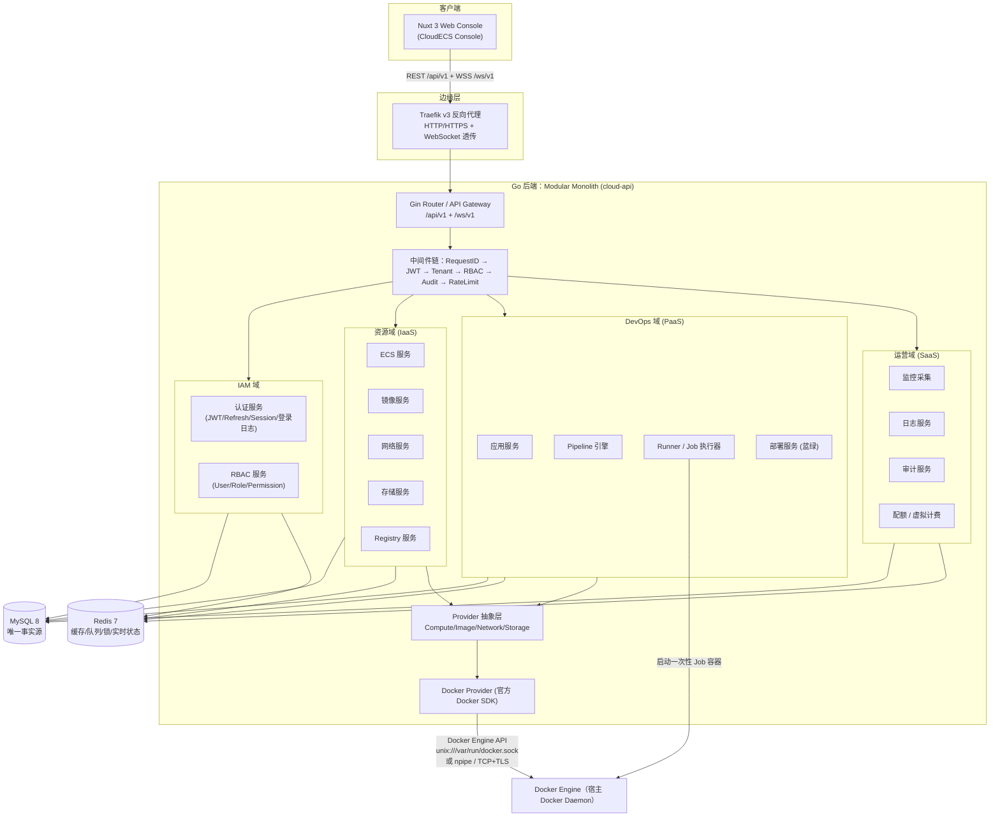

要点：

- 前端永远不能访问 Docker Engine，只能走 `cloud-api` 的 REST/WS。
- `cloud-api` 是唯一挂载 docker.sock 的业务进程。
- MySQL/Redis 只被后端访问，不暴露端口到公网。

---

## 2. 模块架构

### 2.1 Go 后端模块职责

| 包 | 职责 | 依赖 |
|---|---|---|
| `internal/api` | 路由注册、版本化（/api/v1、/ws/v1）、Swagger | handler |
| `internal/middleware` | JWT 鉴权、Tenant 上下文、RBAC、审计、限流、RequestID | iam/repository |
| `internal/handler` | HTTP 层：参数校验、DTO 转换、调用 service、统一响应 | service/dto |
| `internal/service` | 业务编排、事务、状态机、审计埋点 | repository/docker/pipeline |
| `internal/repository` | GORM 数据访问，**强制 Scope 函数**（ByOrg/ByProject） | model |
| `internal/model` | 全部实体与常量（状态枚举、权限码） | - |
| `internal/dto` | 请求/响应结构体 + 校验 tag | - |
| `internal/docker` | DockerProvider：实现 Provider 接口、Labels/命名工具、状态换算 | pkg/dockersdk |
| `internal/pipeline` | Pipeline 引擎：解析 YAML → 步骤 DAG → 队列 → 状态机 | runner |
| `internal/runner` | Job 执行器接口 + DockerJobRunner（一次性容器）+ Kaniko Build | docker |
| `internal/iam` | 认证、刷新令牌轮换、RBAC 决策、密码策略 | repository/redis |
| `internal/websocket` | WS Hub、Terminal/Logs/Stats 桥接、会话注册 | docker/iam |
| `internal/scheduler` | Reconciler（对账）、Metrics 采样、计费 tick、清理任务 | service/docker |
| `internal/config` | 配置加载（env/yaml）、校验、默认值 | - |
| `pkg/` | 无业务工具：logger（zap 结构化）、resp（统一响应）、jwt、redisx、lock、idgen | - |

### 2.2 前端模块结构

- `pages/`：按控制台信息架构分页（见 §17）
- `layouts/`：`console.vue`（侧边栏+顶栏）、`auth.vue`（登录注册）、`terminal.vue`（全屏终端）
- `components/`：`StatCard`、`EcsStateTag`、`ChartPanel`、`ResourceTable`、`Terminal`、`PipelineSteps`…
- `composables/`：`useAuth`、`useProject`（当前项目上下文）、`useEcsWs`、`useChart`
- `stores/`（Pinia）：`auth`、`project`、`ecs`、`pipeline`
- `services/`：`http.ts`（$fetch 封装、错误码映射、token 刷新）、`ws.ts`（自动重连 WS 客户端）
- `middleware/`：`auth.global.ts`（未登录跳转）、`project.ts`（项目上下文选择）
- `utils/`：时间/字节格式化、权限码判断 `hasPerm()`

---

## 3. Docker 集成架构

### 3.1 部署形态

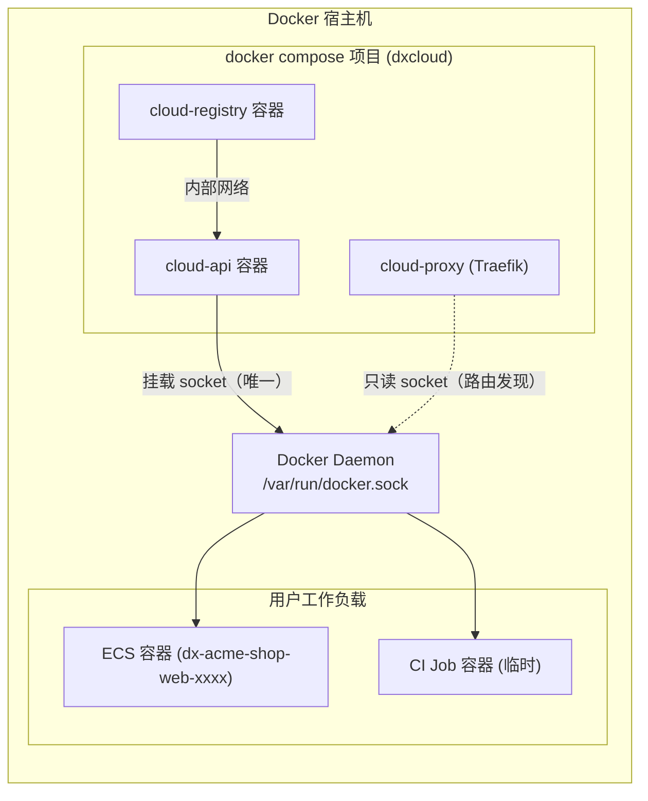

### 3.2 Provider 抽象（核心接口，Go）

```go
// internal/docker/provider.go —— 设计稿（Phase 3 实现）
type ComputeProvider interface {
    Create(ctx context.Context, spec CreateSpec) (Info, error) // docker create + start
    Start(ctx context.Context, id string) error
    Stop(ctx context.Context, id string, force bool) error
    Restart(ctx context.Context, id string) error
    Delete(ctx context.Context, id string, force bool) error
    Inspect(ctx context.Context, id string) (Info, error)
    Logs(ctx context.Context, id string, opt LogsOpt) (io.ReadCloser, error)
    Stats(ctx context.Context, id string) (<-chan Stats, error)
    Exec(ctx context.Context, id string, cmd []string, tty bool) (ExecSession, error)
    WaitHealth(ctx context.Context, id string, probe HealthProbe) error
}

type ImageProvider interface {
    List(ctx context.Context, filter Filter) ([]Image, error)
    Pull(ctx context.Context, ref string, progress func(string)) error
    Remove(ctx context.Context, id string, force bool) error
    Tag(ctx context.Context, src, target string) error
    Push(ctx context.Context, ref string, auth AuthConfig) error
    Inspect(ctx context.Context, ref string) (Image, error)
}

type NetworkProvider interface {
    Create(ctx context.Context, spec NetworkSpec) (Info, error)   // subnet/gateway/iprange
    Remove(ctx context.Context, id string) error
    Connect(ctx context.Context, netID, containerID, fixedIP string) error
    Disconnect(ctx context.Context, netID, containerID string) error
    Inspect(ctx context.Context, id string) (Info, error)
}

type StorageProvider interface {
    Create(ctx context.Context, name string, opt VolumeOpt) (Info, error)
    Remove(ctx context.Context, name string) error
    Inspect(ctx context.Context, name string) (Info, error)
    Usage(ctx context.Context, name string) (int64, error) // 挂载点 du
}

// Docker 实现；未来：KubernetesProvider / PodmanProvider / OpenStackProvider
type DockerProvider struct{ cli *client.Client }
```

### 3.3 云概念 ↔ Docker 对象 ↔ 数据库映射

| 云概念 | Docker 对象 | 数据库表 | 对账锚点（Labels） |
|---|---|---|---|
| ECS Instance | Container | `ecs_instances` | `com.dxcloud.instance-id`, `org-id`, `project-id`, `owner-id` |
| 云镜像 | Image (repo:tag) | `docker_images` | `com.dxcloud.image-id`（构建产物） |
| 私有网络 VPC | Network (bridge) | `docker_networks` | `com.dxcloud.network-id` |
| 云磁盘 | Volume (named) | `docker_volumes` | `com.dxcloud.volume-id` |
| 镜像仓库 | registry:2 容器 + Repository | `registries` / `registry_repositories` | namespace=org/project 前缀 |
| CI Job | 一次性容器 | `pipeline_job_runs` | `com.dxcloud.job-run-id` |

**命名规范**（对账的第二锚点）：

```text
容器：  dx-{org}-{proj}-{name}-{6位随机}     例：dx-acme-shop-web-a1b2c3
网络：  dxn-{netId}                           例：dxn-00012
卷：    dxv-{volId}                           例：dxv-00007
Job：   dxj-{jobRunId}                        例：dxj-100345
```

### 3.4 SDK 与配置

- SDK：`github.com/docker/docker/client`（Docker API ≥ 1.44）。
- 连接方式由 `DOCKER_HOST` 决定，三种都支持：
  - `unix:///var/run/docker.sock`（Linux 生产）
  - `npipe:////./pipe/docker_engine`（Windows Docker Desktop 开发）
  - `tcp://host:2376` + CA 证书（远程引擎，证书路径来自环境变量）
- 生产 Compose 中仅 `cloud-api` 挂载 socket（rw），Traefik 挂载只读 socket 仅用于路由发现。

---

## 4. CI/CD 架构

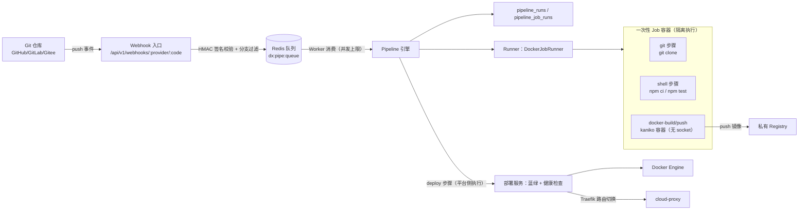

完整闭环时序：

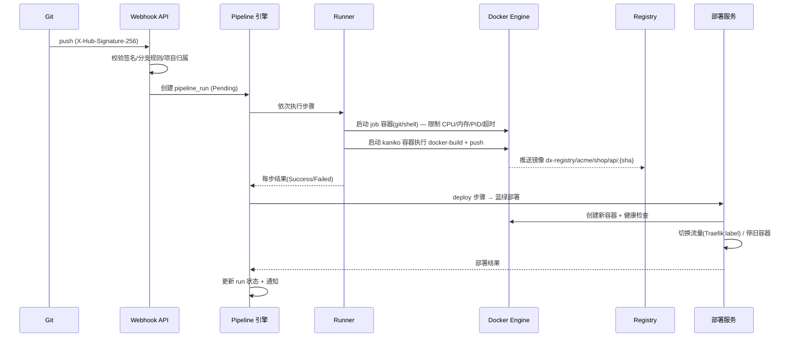

Runner 两种形态（演进路线）：

- **V1（Phase 7-8）**：内嵌 Worker —— pipeline 引擎里的 goroutine 从 Redis 队列消费，直接用 Docker SDK 起 Job 容器。简单、可运行。
- **V2（后续）**：独立 Runner Agent —— 独立二进制/容器注册后轮询 Redis 领取 Job，支持多 Runner 标签分组（如 `linux/amd64`），为多机扩展铺路。

Job 隔离规范（默认值存 `system_settings`，可调）：

| 项 | 默认 | 说明 |
|---|---|---|
| CPU | 2 Core（NanoCPUs） | 按步骤配置可调 |
| Memory | 2048 MB + 交换 0 | 超出 OOM 即失败 |
| PidsLimit | 512 | 防 fork 炸弹 |
| Timeout | 每步 30 min / 全流程 2 h | context 超时 → kill 容器 |
| Network | 每 run 一个隔离 bridge | 禁止 host |
| Workspace | 独立 named volume `dxw-{runId}` | 步骤间共享、结束后清理 |
| 特权 | Privileged=false、no-new-privileges、read-only rootfs + tmpfs /tmp | 不可覆盖 |
| docker.sock | **永不挂载** | build 用 kaniko，无需 socket |

---

## 5. SaaS Multi-Tenant 架构

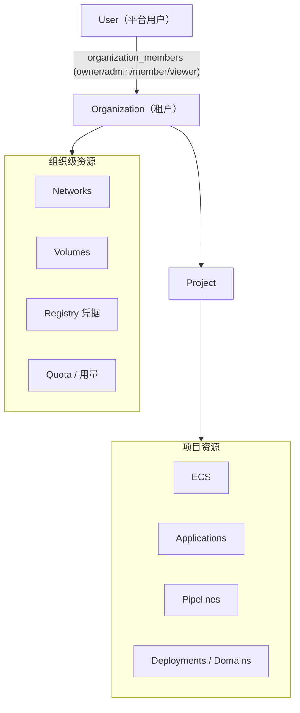

隔离三层防御：

1. **SQL 层**：`repository` 提供 `ScopeByOrg(orgID)` / `ScopeByProject(projID)`，所有资源查询链式调用；中间件从 JWT+URL 解析 org/project 上下文，service 只允许在 scope 内操作。IDOR 攻击在 SQL 层被直接掐断。
2. **Docker 层**：每项目独立 bridge 网络 + 子网段；容器/卷/Job 命名带 org 前缀；Labels 记录归属；默认不发布端口 = 不可从外部访问。
3. **配额层**：`resource_quotas` 按 org（可选 project）限制 ECS 数 / CPU / 内存 / 存储 / 网络数 / Pipeline 数，创建前在 Redis 加分布式锁后校验并预扣。

---

## 6. 数据库 ER 图（核心实体）

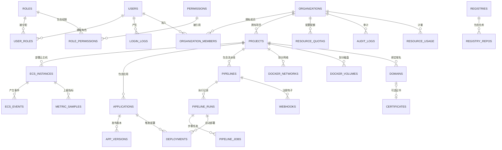

> 完整 34 张表的字段级设计见 §7。

---

## 7. 核心数据库表设计（34 张）

通用约定：所有表含 `id BIGINT PK AUTO_INCREMENT`、`created_at`、`updated_at`，可软删的表加 `deleted_at`（GORM 软删）；租户相关表含 `org_id`、`project_id`、`owner_id` 并建索引。以下只列关键字段与约束。

| # | 表 | 关键字段 | 唯一约束 / 索引 |
|---|---|---|---|
| 1 | `users` | username, email, password_hash(bcrypt), nickname, avatar_url, status(active/disabled/locked), last_login_at, last_login_ip | UK(username), UK(email), idx(status) |
| 2 | `roles` | code, name, description, is_system, scope(global/org/project) | UK(code) |
| 3 | `permissions` | code(`ecs:create`), name, module | UK(code) |
| 4 | `user_roles` | user_id, role_id, org_id NULL | PK(user_id, role_id), idx(org_id) |
| 5 | `role_permissions` | role_id, permission_id | PK(role_id, permission_id) |
| 6 | `login_logs` | user_id, ip, user_agent, status(success/fail), message | idx(user_id, created_at) |
| 7 | `organizations` | name, code, plan(free/basic/pro), credit(虚拟余额), status, created_by | UK(name), UK(code) |
| 8 | `organization_members` | org_id, user_id, org_role(owner/admin/member/viewer), status | PK(org_id, user_id), idx(user_id) |
| 9 | `projects` | org_id, name, code, description, status, created_by | UK(org_id, name), idx(org_id) |
| 10 | `project_environments` | project_id, name(development/testing/staging/production), seq | UK(project_id, name) |
| 11 | `ecs_instances` | instance_no(`i-xxxx`, 云厂商风格), org_id, project_id, owner_id, name, description, image, image_tag, cpu_cores, memory_mb, disk_gb, network_id, fixed_ip, ports(JSON), env(JSON), command(JSON), mounts(JSON), restart_policy, desired_state, observed_state, container_id, container_name, last_error | UK(instance_no), UK(project_id, name), UK(container_id), idx(org_id, project_id, desired_state) |
| 12 | `ecs_instance_events` | instance_id, event_type, level, message, actor_id, request_id | idx(instance_id, created_at) |
| 13 | `docker_images` | org_id, project_id NULL, repo, tag, image_id(digest), size, docker_created_at, source(pull/build/import) | UK(repo, tag) |
| 14 | `docker_networks` | org_id, project_id NULL, name, driver, subnet, gateway, ip_range, internal, docker_network_id | UK(name), idx(org_id) |
| 15 | `docker_volumes` | org_id, project_id NULL, name, driver, mountpoint, capacity_gb(软配额), used_mb | UK(name), idx(org_id) |
| 16 | `applications` | org_id, project_id, owner_id, name, type(node/go/java/python/nginx/mysql/redis/postgres), git_url, git_branch, runner_image, build_cmd, run_cmd, port, health_check_path, env(JSON), status | UK(project_id, name) |
| 17 | `application_versions` | application_id, version, image_ref, commit_sha, status | UK(application_id, version) |
| 18 | `deployments` | org_id, project_id, application_id, environment_id, version_id, strategy(blue-green/rolling), status, health_status, trigger(manual/webhook), pipeline_run_id, started_at, finished_at, notes | idx(application_id, status) |
| 19 | `pipelines` | org_id, project_id, name, description, definition(YAML), trigger_config(JSON), status | UK(project_id, name) |
| 20 | `pipeline_steps` | pipeline_id, name, type, seq, config(JSON) | UK(pipeline_id, seq) |
| 21 | `pipeline_runs` | pipeline_id, run_no, trigger, ref, commit_sha, status, started_at, finished_at, duration_ms, triggered_by | idx(pipeline_id, status) |
| 22 | `pipeline_job_runs` | pipeline_run_id, step_id, name, type, status, exit_code, started_at, finished_at, container_id, log_path | idx(pipeline_run_id) |
| 23 | `webhooks` | project_id, pipeline_id, provider(github/gitlab/gitee), secret_enc, branch_filter, events, status, hook_code(URL 随机码) | UK(hook_code) |
| 24 | `registries` | org_id, name, url, username, password_enc, type(docker-hub/self/other), status | UK(org_id, name) |
| 25 | `registry_repositories` | registry_id, org_id, project_id NULL, namespace, name, visibility, pull_count | UK(registry_id, namespace, name) |
| 26 | `domains` | org_id, project_id, application_id NULL, domain, target_port, tls, cert_id, status | UK(domain) |
| 27 | `certificates` | org_id, domain, cert_pem, key_enc, issuer, expires_at, status | idx(expires_at) |
| 28 | `resource_quotas` | org_id, project_id NULL, resource_type(ecs_count/cpu/memory/storage/network/pipeline), limit_value | UK(org_id, project_id, resource_type) |
| 29 | `resource_usage` | org_id, project_id NULL, resource_type, used_value, period(按小时) | idx(org_id, resource_type, period) |
| 30 | `metric_samples` | instance_id, ts, cpu_pct, mem_used, mem_limit, net_rx, net_tx, disk_read, disk_write | idx(instance_id, ts) |
| 31 | `audit_logs` | org_id NULL, user_id, action, resource_type, resource_id, ip, request_id, detail(JSON), status | idx(org_id, created_at), idx(user_id, created_at) |
| 32 | `operation_logs` | org_id, user_id, module, action, target_type, target_id, target_name, result, duration_ms, ip | idx(user_id, created_at) |
| 33 | `notifications` | user_id, org_id, type, title, content, read_at | idx(user_id, read_at) |
| 34 | `system_settings` | key, value(JSON), description, updated_by | UK(key) |

设计说明：

- `ecs_instances.desired_state`（用户意图）与 `observed_state`（Docker 实况）分离，是 Reconciler 的基础。
- 所有「创建/修改」类操作在 service 层事务内同时写业务表 + `audit_logs`，审计不可绕过。
- 迁移文件按 Phase 顺序编号（`000001_init.sql` …），只增不改，Phase 1 起就包含 `org_id/project_id/owner_id` 列（租户列不能后补）。
- 密码类字段（users.password_hash、registries.password_enc、certificates.key_enc）一律加密/哈希存储。

---

## 8. API 总览（RESTful，前缀 `/api/v1`）

统一响应：

```json
{ "code": 0, "message": "success", "data": {}, "request_id": "req-xxxx" }
{ "code": 40001, "message": "permission denied", "data": null, "request_id": "req-xxxx" }
```

| 模块 | 端点 |
|---|---|
| 认证 | POST /auth/register · /auth/login · /auth/refresh · /auth/logout · GET /auth/me · PUT /auth/password · GET /auth/sessions · DELETE /auth/sessions/:id |
| 用户/角色/权限 | GET/POST /users · GET/PUT/DELETE /users/:id · PUT /users/:id/roles · GET/POST /roles · PUT/DELETE /roles/:id · PUT /roles/:id/permissions · GET /permissions |
| 组织/项目 | GET/POST /organizations · PUT/DELETE /organizations/:id · GET/POST /organizations/:id/members · GET/POST /projects · PUT/DELETE /projects/:id · GET/POST /projects/:id/environments |
| ECS | GET/POST /ecs · GET/PUT/DELETE /ecs/:id · POST /ecs/:id/start · /stop · /force-stop · /restart · GET /ecs/:id/logs · /stats · /events · POST /ecs/:id/exec（换取一次性终端 token）· POST /ecs/:id/recreate（变更挂载） |
| 镜像 | GET /images · GET /images/:id · POST /images/pull · DELETE /images/:id · POST /images/:id/tag · /push |
| 网络 | GET/POST /networks · GET/DELETE /networks/:id · POST /networks/:id/connect · /disconnect |
| 存储 | GET/POST /volumes · GET/DELETE /volumes/:id · POST /volumes/:id/attach · /detach |
| Registry | GET/POST /registries · GET/DELETE /registries/:id · GET/POST /registries/:id/repositories · GET/DELETE /registries/:id/repositories/:rid/tags/:tag |
| 应用/部署 | GET/POST /applications · GET/PUT/DELETE /applications/:id · POST /applications/:id/deploy · GET /applications/:id/versions · POST /applications/:id/versions/:vid/rollback · GET /deployments · GET /deployments/:id |
| Pipeline | GET/POST /pipelines · GET/PUT/DELETE /pipelines/:id · POST /pipelines/:id/run · /cancel · GET /pipeline-runs · GET /pipeline-runs/:id · /logs · /jobs |
| Webhook | POST /webhooks/github/:code · /gitlab/:code · /gitee/:code（签名校验，不走 JWT） |
| 域名/证书 | GET/POST /domains · PUT/DELETE /domains/:id · GET/POST /certificates |
| 监控/日志 | GET /monitor/dashboard · /monitor/ecs/:id · GET /logs?type=system\|operation · GET /audit-logs |
| 配额/计费 | GET/PUT /quotas · GET /usage · GET /billing · GET /billing/records |
| 系统 | GET/PUT /settings · GET /notifications · PUT /notifications/:id/read |

---

## 9. WebSocket 总览

| 端点 | 鉴权 | 用途 |
|---|---|---|
| `/ws/v1/ecs/:id/terminal` | 一次性终端 token（Redis，60s TTL，绑定 user+instance+权限 `ecs:console`） | Web Terminal |
| `/ws/v1/ecs/:id/logs` | JWT + 权限 `ecs:logs` + 属主校验 | 实时容器日志 |
| `/ws/v1/ecs/:id/stats` | JWT + 权限 `ecs:stats` + 属主校验 | 实时 CPU/内存/网络 |
| `/ws/v1/pipeline-runs/:id/logs` | JWT + 权限 `pipeline:view` + 项目校验 | Pipeline 实时日志 |

统一握手与协议：

1. 客户端先调 REST 获取连接参数（terminal 用一次性 token；logs/stats 用 JWT，通过 `Sec-WebSocket-Protocol: Bearer, <token>` 或 `?token=` 传递）。
2. 服务端握手前完成：JWT 解析 → RBAC → 资源属主/项目校验 → 审计（连接成功/失败都记录）→ 注册到 WS Hub。
3. 消息协议（JSON 控制帧 + 二进制数据帧）：
   ```json
   { "type": "resize", "cols": 120, "rows": 30 }
   { "type": "ping" }
   { "type": "close", "code": 4001, "reason": "idle timeout" }
   ```
4. Terminal 数据流：浏览器 xterm.js ↔ WS ↔ `ContainerExecAttach`（TTY hijack），stdin/stdout/stderr 全双工；resize 帧 → `ResizeExecTTY`。
5. 超时：终端空闲 15 分钟自动关闭；连接中断后端立即销毁 exec 会话。
6. 防逃逸：exec 会话绑定单个容器（docker exec 本质就是进程级隔离），容器自身默认非特权 + 无 socket + no-new-privileges（见 §12）。

---

## 10. Redis 使用方案

原则：**Redis 只缓存可重建数据，MySQL 是唯一事实源；Redis 被清空系统必须能自愈。**

| Key 模式 | 类型 | TTL | 用途 |
|---|---|---|---|
| `auth:refresh:{jti}` | HASH | 7d | Refresh Token（轮换：旧 jti 删除，泄露即失效） |
| `auth:deny:{jti}` | STRING | 到 exp | 退出/踢出后的 Access Token 黑名单 |
| `rate:{scope}:{route}:{win}` | ZSET 滑窗 | 窗口 | 限流（login 5/min/IP，API 100/min/user，Webhook 20/min） |
| `ws:token:{token}` | HASH | 60s | 一次性终端 token → user/instance/permission |
| `ws:conn:{instanceId}` | SET | 会话期 | 在线 WS 连接注册（断线清理、广播用） |
| `ecs:state:{instanceId}` | STRING | 10s | Reconciler 写入的实时状态缓存（前端列表秒开） |
| `lock:{name}` | STRING SETNX EX | ≤30s | 分布式锁：部署切换、IP 分配、配额预扣、Reconciler 单例 |
| `queue:pipe:jobs` | LIST | - | Pipeline 任务队列（BLPOP） |
| `chan:pipe:{runId}` | PUBSUB | - | Pipeline 实时事件广播（步骤状态推送到 WS） |
| `cache:perms:{userId}` | HASH | 5min | 用户权限缓存（角色变更时主动失效） |
| `cache:dash:{orgId}` | STRING | 15s | Dashboard 聚合数据缓存 |
| `meter:{orgId}:{type}:{hour}` | HASH | 2h | 计费累加（每小时落库到 resource_usage） |

---

## 11. Docker Engine 集成方案

1. **唯一入口**：`internal/docker.DockerProvider` 是全部 Docker API 调用的唯一封装层，业务代码出现 `client.` 即视为违规（code review 红线）。
2. **连接**：启动时按 `DOCKER_HOST` 选择 unix/npipe/tcp+TLS；启动自检（ping + info）失败则服务拒绝启动（fail-fast，避免「半活」状态）。
3. **资源创建流程**（以 ECS 为例）：参数校验 → 配额检查（锁）→ 权限检查 → 分配 IP（锁）→ `docker create`（带完整 Labels + HostConfig 安全基线）→ `docker start` → DB 事务写记录 → 事件 + 审计 → WS 广播。任何一步失败：清理容器、写事件、状态标 Failed。
4. **对账（Reconciler）**：每 30s 一轮：
   - DB 中处于 Creating/Running/Stopping/Restarting/Deleting 的实例 → inspect 容器 → 回写 observed_state，推进状态机（超时 → Failed）。
   - Docker 中存在、DB 不存在的带标签容器 → 记录为「孤儿/漂移」事件，超管可导入或清理。
   - DB 为 Running 但容器消失 → 状态置 Unknown 并发事件。
   - 镜像/网络/卷漂移同步（未打标签的视为外部资源，只读展示给 Admin）。
5. **指标采集**：Reconciler 内 goroutine 对 Running 实例每 5s 拉 stats 写 Redis，每 60s 抽样落库 `metric_samples`（历史曲线数据源）。
6. **Windows 开发**：Docker Desktop 下 `DOCKER_HOST=npipe:////./pipe/docker_engine`；生产统一 unix socket。代码不做平台特判，全靠 SDK 的 host 适配。

---

## 12. 安全模型（分层防御）

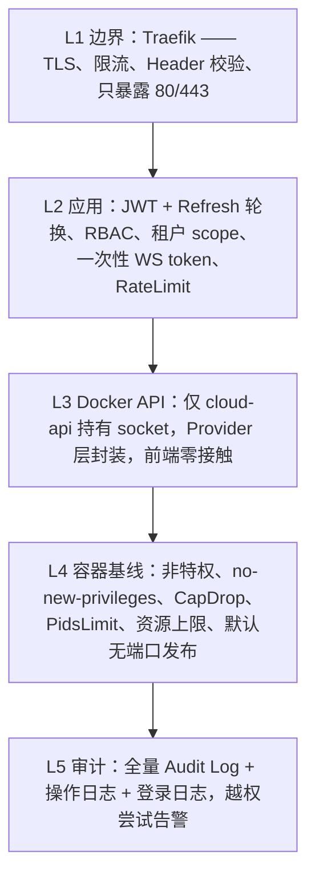

威胁 → 对策对照表：

| 威胁 | 对策 |
|---|---|
| 命令注入（CI shell 步骤） | 脚本只作为参数传入容器（非拼接 shell 字符串）；git URL 白名单协议（https/git），禁 file://；步骤 schema 校验 |
| 容器逃逸 | 默认 seccomp + 非特权 + no-new-privileges + CapDrop ALL（按需 CapAdd NET_BIND_SERVICE 等白名单）+ PidsLimit；禁 host PID/IPC |
| 特权容器滥用 | `privileged/host网络/hostPID/docker.sock` 默认禁止，仅 SuperAdmin 通过「安全策略白名单」开启且写审计 |
| 资源耗尽 | 所有容器强制 CPU/内存上限（配额内），Job 加超时；宿主机水位监控告警 |
| 恶意镜像 | 默认只允许可信 Registry（内置私有 Registry + 显式添加的源）；高危端口/卷挂载在创建表单校验；Admin 可配置镜像来源白名单 |
| Docker Socket 滥用 | socket 仅后端容器持有；CI Job 永不挂载 socket（kaniko 构建）；Traefik 只读挂载 |
| 路径穿越 | 上传/下载路径规范化 + 白名单目录；Workspace 卷隔离 |
| SSRF | Webhook URL、Registry URL、健康检查 URL 校验：禁内网/云元数据地址（169.254.169.254 等），DNS 解析后二次校验 |
| WebSocket 劫持 | 握手强制鉴权（JWT/一次性 token）+ Origin 校验 + 空闲超时；token 不落 URL 日志 |
| JWT 滥用 | Access 15min + Refresh 7d 轮换 + 退出即黑名单 + Redis 会话管理 + 密钥环境变量注入 |
| IDOR | 资源 ID 永不做权限判断依据：SQL 强制 org/project scope；审计比对 user 与 owner |
| 租户逃逸 | 三层隔离（§5）+ 渗透测试用例（§19 测试计划） |

容器安全基线（创建任何容器时的默认 HostConfig，代码级强制）：

```text
Privileged: false
CapDrop: [ALL], CapAdd: [NET_BIND_SERVICE, CHOWN, SETUID, SETGID, DAC_OVERRIDE]（按镜像类型白名单）
SecurityOpt: [no-new-privileges]
PidsLimit: 256
Memory/NanoCPUs: 取自实例规格（被配额上限钳制）
NetworkMode: 项目私有 bridge（禁止 host/none）
Mounts: 仅允许项目内卷 + 平台白名单路径；/var/run/docker.sock 与宿主根路径硬编码拒绝
ReadonlyRootfs: 可选（表单勾选），Tmpfs /tmp
RestartPolicy: 用户可选（默认 no）
```

---

## 13. 权限模型（RBAC）

### 13.1 默认角色矩阵

| 权限组 | SuperAdmin | Admin | Developer | Operator | User | Viewer |
|---|---|---|---|---|---|---|
| 系统全局、所有用户、所有租户 | ✅ | ❌ | ❌ | ❌ | ❌ | ❌ |
| 组织/成员/配额/计费 | ✅ | ✅(本组织) | ❌ | ❌ | ❌ | ❌ |
| ecs:create/delete/recreate | ✅ | ✅ | ✅(项目内) | ❌ | ✅(仅自己资源) | ❌ |
| ecs:start/stop/restart/console/logs/stats | ✅ | ✅ | ✅ | ✅ | ✅(自己资源) | ❌ |
| image / network / volume 管理 | ✅ | ✅ | ✅ | ❌ | ❌ | ❌ |
| app / pipeline / deployment 管理 | ✅ | ✅ | ✅ | ✅(仅 run/cancel) | ✅(自己应用) | ❌ |
| 所有模块只读 | ✅ | ✅ | ✅ | ✅ | ✅ | ✅ |

### 13.2 权限码（前缀 = 模块，完整表在 Phase 2 迁移中落库）

```text
ecs:list ecs:get ecs:create ecs:update ecs:delete
ecs:start ecs:stop ecs:restart ecs:force-stop ecs:console ecs:logs ecs:stats ecs:recreate
image:list image:pull image:delete image:build image:tag image:push
network:list network:create network:delete network:connect
volume:list volume:create volume:delete volume:attach
registry:list registry:create registry:delete registry:push registry:pull
app:list app:create app:update app:delete app:deploy app:rollback
pipeline:list pipeline:create pipeline:update pipeline:delete pipeline:run pipeline:cancel
project:list project:create project:update project:delete project:deploy
domain:list domain:create domain:delete domain:bind
user:list user:create user:update user:delete user:grant
org:list org:create org:update org:delete org:member:manage
quota:view quota:update billing:view
audit:view settings:view settings:update
```

### 13.3 强制执行链（后端，不只是前端隐藏按钮）

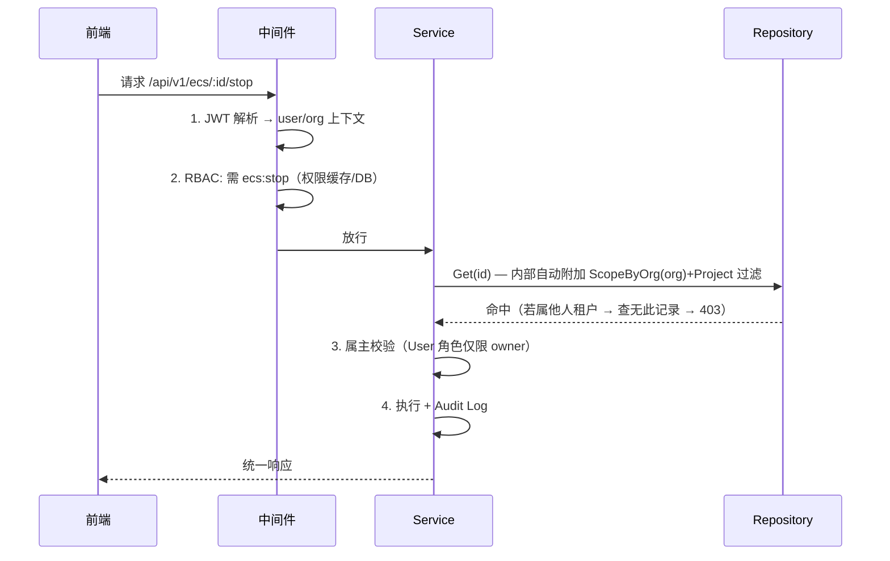

三条铁律：权限检查在中间件、资源归属过滤在 Repository、审计在 Service——三者缺一，review 不通过。

---

## 14. ECS 生命周期

### 14.1 状态机

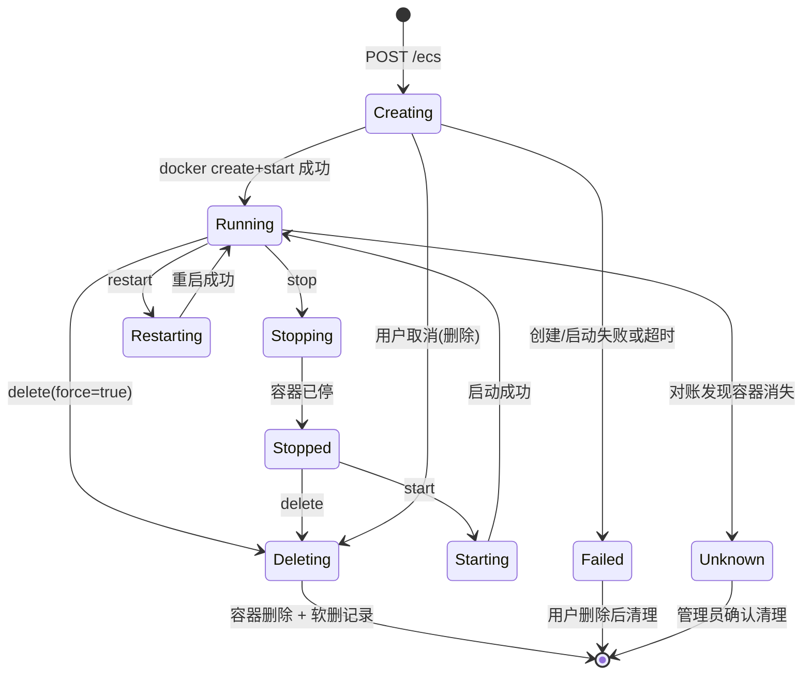

状态字段：`desired_state`（DB，用户意图）+ `observed_state`（Docker 实况）。终态含义：

| 状态 | 含义 | 触发 |
|---|---|---|
| Creating / Starting / Stopping / Restarting / Deleting | 过渡态 | 用户操作，带超时（默认 60s → Failed） |
| Running / Stopped | 稳态 | 操作成功 |
| Failed | 操作失败，保留记录可删除 | 任何错误、超时 |
| Unknown | DB 与 Docker 失联（容器失踪/引擎重启） | Reconciler |

### 14.2 创建流程与规格映射

`instance_no` 形如 `i-a1b2c3d4`（对外展示 ID），`container_id` 是 Docker 64 位 ID（对账用）。

| 云规格字段 | Docker 映射 |
|---|---|
| CPU 2 Core | `NanoCPUs = 2e9`，`CPUPeriod/Quota` |
| Memory 2 GB | `Memory = 2147483648`（swap=0 防偷跑） |
| Disk 20 GB | V1 为**逻辑配额**（DB 记录 + `df` 上报）；数据卷硬配额（xfs project quota）在 Phase 11 |
| 端口 80→80 | `PortBindings`（占用冲突检查：DB + 运行时双查） |
| 网络 + IP | 项目 bridge + 静态 IPAM（IP 池由网络子网管理，分配加锁） |
| 环境变量/启动命令 | `Env` / `Entrypoint`+`Cmd`（允许空命令 = 镜像默认） |
| 自动启动 | `RestartPolicy: unless-stopped`（默认关闭） |

### 14.3 对账规则（Reconciler，30s）

1. 过渡态超时 → Failed + 事件。
2. observed != desired → 以 observed 回写 DB 并发事件（如引擎重启导致容器变 Stopped）。
3. 孤儿容器（有标签无 DB 行）→ `Unknown` 事件，SuperAdmin 可导入/清理。
4. 删除语义：`DELETE /ecs/:id` 默认保留镜像与卷，仅删除容器 + 软删记录；事件与审计全留痕。

---

## 15. Pipeline 生命周期

### 15.1 状态机

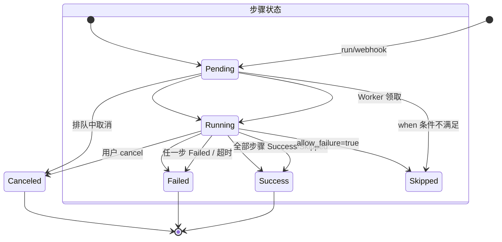

### 15.2 引擎规则

- Pipeline 定义 = YAML（存 `pipelines.definition`），解析时做 schema 校验（步骤类型白名单：`git / shell / docker-build / docker-push / docker-deploy / wait-health`，V1 不支持任意镜像步骤）。
- 串行执行（V1），`allow_failure: true` 的步骤失败记为 Skipped；每步 `timeout` 可覆盖全局。
- 取消：context cancel → kill 当前 Job 容器 → 状态 Canceled → 清理 workspace。
- 并发控制：全局 worker 数（settings，默认 3）+ 每 org 并发上限（配额）。
- 日志：每 Job 独立日志流 → WS 推送 + 落盘（`log_path`）→ 完成 7 天后清理（settings 保留期）。

---

## 16. Deployment 生命周期（蓝绿，V1）

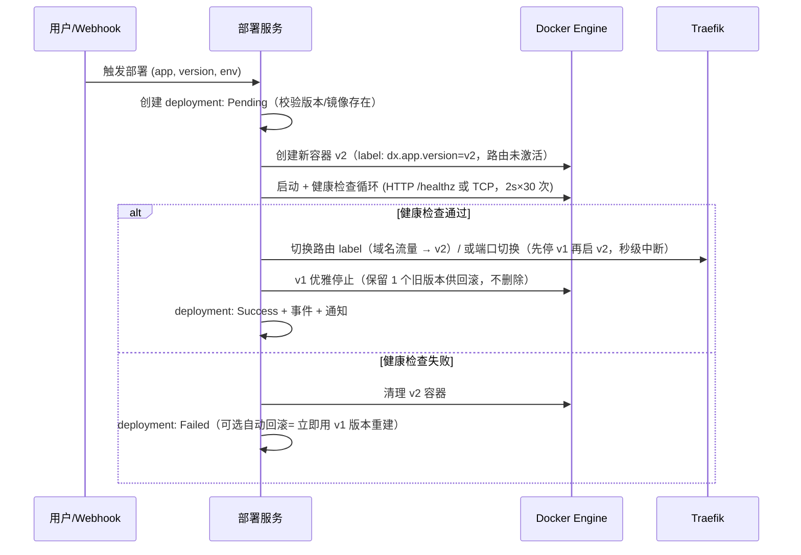

要点：

- 回滚 = 「用历史版本再执行一次部署」，`application_versions` 保留全部历史镜像引用，永远可回滚。
- 域名绑定的应用走 Traefik label 切换（**零中断**）；仅端口映射的应用端口切换有秒级中断（Docker 不支持热改端口映射，记录为已知限制）。
- 滚动更新（Replica=3 逐批替换）为 Phase 8+ 特性，接口（deployments.strategy）已预留。

---

## 17. 项目目录结构

```text
dxcloud/
├── backend/
│   ├── cmd/server/main.go            # 入口：装配 config → db → redis → provider → router
│   ├── internal/
│   │   ├── api/router.go             # 路由注册 + WS 路由
│   │   ├── middleware/               # auth.go tenant.go rbac.go audit.go ratelimit.go requestid.go
│   │   ├── handler/                  # auth/ ecs/ image/ network/ volume/ registry/ app/ project/
│   │   │                             # pipeline/ deployment/ domain/ iam/ org/ monitor/ log/ quota/ billing/
│   │   ├── service/                  # 与 handler 一一对应（业务编排层）
│   │   ├── repository/               # GORM 仓库 + scope.go（ByOrg/ByProject）
│   │   ├── model/                    # 34 张表实体 + 状态常量 + 权限码
│   │   ├── dto/                      # 请求/响应结构体
│   │   ├── docker/                   # provider.go(接口) docker_provider.go 命名与 labels 工具
│   │   ├── pipeline/                 # engine.go yaml_parser.go step_executor.go
│   │   ├── runner/                   # runner.go docker_job_runner.go kaniko.go
│   │   ├── iam/                      # auth_service.go rbac_service.go token.go
│   │   ├── websocket/                # hub.go terminal.go logs.go stats.go
│   │   ├── scheduler/                # reconciler.go metrics.go billing.go cleaner.go
│   │   └── config/config.go
│   ├── migrations/                   # 000001_init.sql ...（按 Phase 递增）
│   ├── pkg/                          # logger/ resp/ jwt/ redisx/ lock/ idgen/ utils
│   ├── Dockerfile
│   └── go.mod
├── frontend/
│   ├── pages/                        # auth/login.vue auth/register.vue
│   │                                 # dashboard/index.vue
│   │                                 # ecs/index.vue ecs/create.vue ecs/[id].vue ecs/[id]/terminal.vue ecs/[id]/monitor.vue
│   │                                 # images/ networks/ volumes/ apps/ projects/ pipelines/ pipeline-runs/[id]/
│   │                                 # deployments/ domains/ logs/ iam/users iam/roles iam/permissions
│   │                                 # orgs/ billing/ settings/index.vue
│   ├── components/ layouts/ composables/ stores/ services/ types/ middleware/ utils/ assets/
│   ├── nuxt.config.ts Dockerfile package.json
├── deploy/
│   ├── docker-compose.dev.yml
│   ├── docker-compose.prod.yml
│   ├── traefik/traefik.yml
│   └── registry/htpasswd.generated
├── .env.example
├── docs/                            # 本文档 + 每 Phase 的设计说明
└── README.md
```

---

## 18. Docker Compose 架构

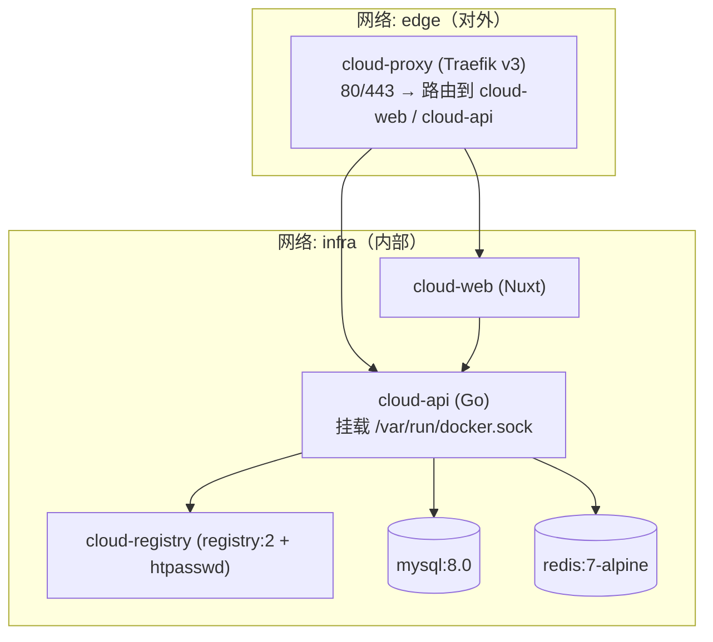

服务清单与数据卷：

| 服务 | 镜像 | 端口 | 卷 | 说明 |
|---|---|---|---|---|
| cloud-api | 自构建 backend | 8080（仅 infra） | `/var/run/docker.sock`（rw） | 唯一 socket 持有者；健康检查 `/healthz` |
| cloud-web | 自构建 frontend | 3000（仅 infra） | - | Nuxt（SSR/SPA 视确认结果） |
| cloud-proxy | traefik:v3 | 80/443 | docker.sock（**只读**）、acme.json | 路由 + 未来自动 HTTPS |
| mysql | mysql:8.0 | 3306（仅 infra） | mysql-data | 健康检查 `mysqladmin ping`，字符集 utf8mb4 |
| redis | redis:7-alpine | 6379（仅 infra） | redis-data | 密码来自 env |
| cloud-registry | registry:2 | 5000（仅 infra） | registry-data + htpasswd | 后端代管 htpasswd 机器人账号 |

`.env.example` 关键项（敏感信息零硬编码）：

```bash
MYSQL_HOST=mysql  MYSQL_PORT=3306  MYSQL_DATABASE=dxcloud
MYSQL_USER=dxcloud  MYSQL_PASSWORD=change_me
REDIS_HOST=redis  REDIS_PORT=6379  REDIS_PASSWORD=change_me
JWT_SECRET=change_me_to_64_random_chars
JWT_ACCESS_TTL=15m  JWT_REFRESH_TTL=168h
DOCKER_HOST=unix:///var/run/docker.sock   # Windows 开发: npipe:////./pipe/docker_engine
REGISTRY_URL=cloud-registry:5000  REGISTRY_PUBLIC_URL=registry.example.com
REGISTRY_USER=robot  REGISTRY_PASSWORD=change_me
CONSOLE_BASE_URL=http://localhost:8080
TRAEFIK_ENTRYPOINTS=web
```

- `docker-compose.dev.yml`：本地开发（挂载源码、热重载、API 暴露 8080 便于 curl 调试）。
- `docker-compose.prod.yml`：多阶段构建产物、restart=always、日志轮转、健康检查、备份卷。
- 用户工作负载（ECS 容器/Job）与平台组件通过 Docker label 区分，compose 只管平台组件。

### 18.1 开发环境（本机 Windows · 用户实测）

- 本机 MySQL：`127.0.0.1:3306`，账号 `root` / 密码 `root`（仅限开发；生产 compose 内 mysql:8 使用独立账号）
- 本机 Redis：`127.0.0.1:6379`，Windows 原生 Redis **3.0.504**（64bit，standalone），无密码
- **Redis 3.0 兼容性约束**：§10 的 Redis 方案刻意只使用 3.0 兼容原语（LIST 队列、ZSET 滑窗限流、`SET NX EX` 分布式锁、HASH、PUBSUB），**不使用 Streams 与 ACL**，因此本机 Redis 3.0 可直接用于开发；生产环境统一使用 compose 内 `redis:7-alpine`
- 开发模式 A（推荐）：Windows 本机 `go run` 后端 + `pnpm dev` 前端，直连上述本机 MySQL/Redis；Docker 引擎走 Docker Desktop（`DOCKER_HOST=npipe:////./pipe/docker_engine`）
- 开发模式 B：`docker compose -f deploy/docker-compose.dev.yml up -d` 全容器环境（mysql:8 + redis:7 容器版）
- 两种模式的 `.env` 差异：本机 `MYSQL_HOST=127.0.0.1`、`REDIS_HOST=127.0.0.1`、`REDIS_PASSWORD=`；compose 内为服务名 `mysql` / `redis`

---

## 19. 开发阶段规划（Phase 0-12）

| Phase | 目标 | 关键交付 | 验收标准（可执行） |
|---|---|---|---|
| 0 | 架构设计 | 本文档 | 你确认通过 ✅ |
| 1 | 项目骨架 | 前后端可启动、compose 一键起、Migration 框架、统一响应/日志/错误码、**含 org/project/owner 列的初始 schema** | `docker compose up -d` 后访问 Web 见登录页；`/healthz` OK |
| 2 | 认证 + RBAC | 注册/登录/刷新/退出/改密/会话、6 默认角色 + 权限码落库、审计、登录日志 | curl 全流程 + 越权返回 40001；DB 种子数据正确 |
| 3 | ECS 核心 | 创建/启动/停止/重启/删除/日志/统计/事件/详情 + Reconciler 第一版 + 配额检查 | 网页创建 nginx ECS → Running → stats/logs 可用；杀容器后 30s 内状态对账为 Unknown |
| 4 | Web Terminal | xterm.js + WS + docker exec TTY + resize + 超时 + 一次性 token | 浏览器打开终端执行 ls/ps/top；无 token 握手被拒 |
| 5 | 镜像/网络/存储/Registry | Provider 全接口、私有 Registry（namespace/tag/push/pull）、子网 + 静态 IP、卷挂载 | 创建网络 → ECS 获得 10.10.0.x；pull/push 镜像闭环 |
| 6 | 应用/项目/环境/域名/部署 | Application CRUD、环境、版本、蓝绿部署 + 健康检查 + 回滚、Traefik 域名路由 | 手动部署 → 域名访问成功 → 回滚秒级生效 |
| 7 | Pipeline 引擎 | YAML 解析/校验、队列、状态机、步骤日志、取消、超时 | UI 触发 Pipeline → git/shell 步骤日志实时滚动 → Success |
| 8 | Runner + Webhook + 自动部署 | Job 容器隔离执行、kaniko 构建推送、GitHub/GitLab/Gitee 签名 Webhook、push 自动触发 | push 代码 → 全自动 Build→Push→Deploy→HealthCheck→Success |
| 9 | 监控/日志/审计/事件 | Dashboard 图表、指标采样落库、多类日志检索、通知 | Dashboard 曲线随实例负载变化；审计可检索 |
| 10 | Multi-Tenant 完整化 | 组织/成员/角色、配额 UI、虚拟计费、用量报表 | 双组织资源互相不可见（含 API/WS/SQL 三层验证） |
| 11 | 安全加固 | 容器基线全量落地、限流、SSRF/穿越防护、卷硬配额、渗透测试用例 | 安全测试集全部通过（见 §47 清单） |
| 12 | 生产部署 | prod compose、Traefik HTTPS（手动证书→后续自动续期）、备份/恢复、迁移、健康检查 | 公网 https:// 访问全流程；mysql/redis/registry 数据备份可恢复 |

> 关键安排：Multi-Tenant 的「功能」在 Phase 10，但「租户列 + Scope 中间件」从 Phase 1 就在 schema 与代码框架里，避免后期大规模返工。

---

## 20. 风险清单

| # | 风险 | 影响 | 缓解措施 | 阶段 |
|---|---|---|---|---|
| 1 | docker.sock 被攻破（后端 RCE） | 宿主机沦陷 | socket 仅后端持有；后端容器最小权限；容器安全基线；审计+告警 | P1/P11 |
| 2 | 租户隔离 SQL 遗漏（IDOR） | 数据越权 | Repository Scope 强制 + 权限测试集覆盖每个端点 | P2 起持续 |
| 3 | 恶意/未知镜像供应链 | 挖矿/后门 | 镜像来源白名单、私有 Registry 优先、高危配置表单拦截 | P5/P11 |
| 4 | CI Job 资源耗尽拖垮宿主 | 全平台不可用 | 强制 CPU/内存/PID/超时 + 全局并发上限 + 宿主水位告警 | P8 |
| 5 | 单节点 Docker 无 HA | 宕机全停 | V1 明确单机；文档说明备份/恢复；V2 接 K8s/多机 Runner | P12+ |
| 6 | overlay2 无法限制单容器根盘 | 磁盘超卖 | V1 逻辑配额 + df 上报 + 告警；卷 xfs 硬配额（P11） | P3/P11 |
| 7 | 端口切换导致秒级中断 | 用户体验 | 域名应用走 Traefik 零中断；端口应用明确提示 | P6 |
| 8 | DB 与 Docker 状态漂移 | 幽灵资源 | Reconciler + Labels 对账 + 事件 | P3 起持续 |
| 9 | Redis 数据丢失 | 会话/缓存失效 | Redis 只存可重建数据；重启自愈；持久化 AOF | P1 |
| 10 | Web Terminal 被滥用（越权/爆破） | 容器被控制 | 一次性 token + RBAC + 属主校验 + 空闲超时 + 审计 | P4 |
| 11 | Pipeline 并发争抢端口/IP | 部署冲突 | 分布式锁（端口分配/部署切换）+ 部署队列 | P6/P8 |
| 12 | 敏感信息泄露（.env/日志） | 凭据泄露 | .env 不提交、密码加密存储、日志脱敏（token 不进日志）、审计 | 全程 |

---

## 21. 十五个重点问题逐条回答

1. **没有 OpenStack，如何用 Docker 模拟 ECS？** 靠「产品层抽象」而非底层虚拟化：ECS 是一条数据库记录（规格 CPU/内存/磁盘/镜像/网络/IP/端口/生命周期），底层映射为一个带资源限制的 Docker 容器。用户感知的云主机体验（规格选择、公网 IP、状态机、控制台、监控）全部由产品层提供；磁盘配额为逻辑配额（V1 软限制）。差距是单机、无真隔离内核，安全靠 §12 容器基线弥补。
2. **如何设计 ComputeProvider 抽象？** 见 §3.2：`ComputeProvider/ImageProvider/NetworkProvider/StorageProvider` 四个接口 + `DockerProvider` 实现；业务层只依赖接口；新增后端 = 新增实现 + 注册到 Provider 工厂（配置 `provider: docker|k8s|podman`）。
3. **Docker Container 与 ECS Instance 如何映射？** 1:1。`ecs_instances.instance_no`（对外 ID）↔ `container_id`（Docker ID），容器打 `com.dxcloud.instance-id` 等标签，Reconciler 靠标签双向对账（§3.3、§14.3）。
4. **Docker Network 如何模拟云网络？** 每个「云网络」= 一个 bridge Docker network（自定义 subnet/gateway/iprange，如 10.10.0.0/16）；实例加入网络时从 DB 管理的 IP 池分配静态 IP（加锁防冲突）；端口发布=公网入口；V1 没有内核级安全组，暴露面控制 =「默认不发布任何端口」。跨网络互通、网络 ACL 留待后续（可接 nftables）。
5. **Docker Volume 如何模拟云磁盘？** named volume = 云磁盘；容量为软配额（DB 记录 + 定期 `du` 上报），Phase 11 用 xfs project quota 做硬配额；「挂载/卸载」= 创建实例时挂载，变更挂载需 recreate（Docker 限制，产品上叫「更换磁盘后重建」，数据卷保留）。
6. **Docker Registry 如何模拟镜像仓库？** 内置 registry:2 容器（internal 网络 + htpasswd 机器人账号，后端代管凭据），仓库命名 `{org}/{project}/{app}` 即 namespace 体系；Kaniko/Runner 以机器人身份 push，用户 Pull 由后端代理鉴权；Docker Hub 通过拉取后 `tag` 进私有仓或直连（白名单）。
7. **如何实现 Web Terminal？** 浏览器 xterm.js ↔ WSS ↔ 后端 ↔ `docker exec` TTY attach。鉴权=一次性 Redis token（60s）；全双工二进制流；resize 控制帧；空闲超时销毁会话；审计记录会话起止（§9）。
8. **如何实现 CI/CD Runner？** V1 = 后端内嵌 Worker（Redis 队列 → DockerJobRunner 起一次性 Job 容器）；Job 强制资源限制 + 超时 + 独立 workspace 卷；`docker-build/push` 用 kaniko 容器（**不挂 socket**）；`docker-deploy` 由平台部署服务执行（Job 容器没有 Docker 权限）。V2 拆独立 Runner Agent（§4）。
9. **如何实现 Multi-Tenant？** User → Organization（租户）→ Project → 资源，四级归属；所有资源表含 org_id/project_id/owner_id；SQL 强制 scope、Docker 层独立网络+命名前缀、配额限总量（§5）。
10. **如何保证租户间资源隔离？** 三层：SQL 查询强制过滤（IDOR 免疫）、Docker 资源物理隔离（不同 bridge 网络、命名前缀、标签）、配额防止资源挤占；再加审计与渗透测试验证（§12、§19）。
11. **如何防止 Docker Socket 被滥用？** socket 只挂载进 cloud-api（唯一业务持有者）；前端/Runner/用户容器零接触；Provider 封装所有调用；Traefik 只读挂载仅用于路由发现；后端容器自身最小权限 + 审计所有高危动作（§12 L3）。
12. **如何实现 Resource Reconciliation？** 双状态模型 + 30s Reconciler：标签锚点双向扫描、过渡态超时推进、漂移/孤儿检测、指标采样、计费 tick；未来替换后端（K8s）时 Reconciler 逻辑不变，只换 Provider 的 Inspect 实现（§11.4、§14.3）。
13. **如何实现自动部署和回滚？** 自动部署=Webhook→Pipeline→kaniko build/push→deploy 步骤；部署=蓝绿（新容器+健康检查+Traefik 路由切换零中断，端口型秒级中断）；回滚=任意历史版本重新执行部署，永不删版本记录（§16）。
14. **哪些第一版做，哪些延期？** 见 §22 清单。
15. **如何让未来接入 Kubernetes/OpenStack？** Provider 接口已把「计算/镜像/网络/存储」四类能力与 Docker 解耦；Reconciler 只依赖 Inspect/List 等通用语义；ECS 规格（cpu/mem/disk/ports）天然映射 K8s `resources/limits + PV/PVC + Service`（K8sProvider）或 OpenStack Nova/Cinder/Neutron（OpenStackProvider）；部署策略层（蓝绿/滚动）保持独立可复用。切换成本=新增 Provider 实现 + 配置开关，业务层零改动。

---

## 22. V1 范围与延期清单

**V1 必做（Phase 1-12）**：注册登录 JWT/RBAC、ECS 全生命周期 + 对账、Web Terminal、日志/Stats、镜像/网络/卷、私有 Registry、Project/Environment、Application、蓝绿部署 + 健康检查 + 回滚、域名（Traefik 路由）、Pipeline 引擎 + Runner（内嵌）+ Webhook 自动部署、监控 Dashboard、审计/操作/登录日志、组织与配额、虚拟计费、安全基线、prod compose + 备份。

**明确延期**：滚动更新多副本、多 Runner Agent 分布式执行、Jenkins/GitLab CI/GitHub Actions 外部集成、Let's Encrypt 自动续期（V1 手动证书上传）、安全组/网络 ACL、Kubernetes/Podman/OpenStack Provider、真实支付、多机 HA、计费账单导出。

**Phase 1 就预留但后续启用**：租户列与 Scope（P10 启用功能）、`deployments.strategy` 字段（滚动更新）、Runner 队列协议（P8 拆 Agent）、Provider 工厂注册表（未来后端）。

---

## 23. 已确认决策与结语

架构设计（Phase 0）输出完毕，未写任何 Phase 1 代码。当前决策记录：

- **技术选型（用户授权默认）**：Naive UI + SPA 渲染 + Traefik v3（如无异议按此执行）。
- **开发环境**：本机 Windows；MySQL `127.0.0.1:3306`（root/root）；Redis `127.0.0.1:6379`（3.0.504 无密码，仅开发）。详见 §18.1。
- **下一步**：等待用户确认后进入 Phase 1（项目骨架：Go 后端 + Nuxt 3 前端 + MySQL/Redis 接入 + Docker Compose + 初始 Migration，`docker compose up -d` 可启动）。
